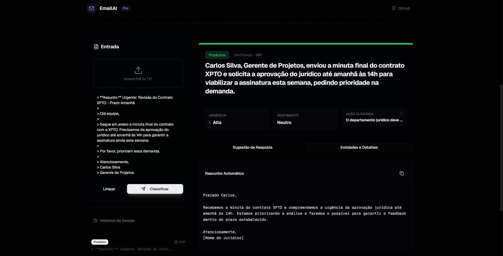
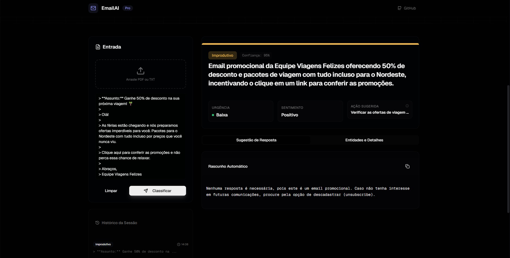

# 🧠 EmailAI — Classificador Inteligente de Emails com IA

> 🚀 Solução Fullstack moderna para automação e triagem inteligente de e-mails corporativos, com leitura de PDFs, análise semântica e geração de respostas usando Inteligência Artificial Generativa.

---

## 📌 Sobre o Projeto

O **EmailAI** é uma aplicação inovadora que classifica automaticamente e-mails em categorias como **Produtivo** ou **Improdutivo**, extrai insights semânticos (como urgência e sentimento) e sugere respostas profissionais baseadas no contexto da mensagem.  
Essa solução foi desenvolvida para demonstrar habilidades práticas em **IA generativa, desenvolvimento backend e frontend moderno**, arquitetura de microsserviços e integração com APIs avançadas — tornando-a uma excelente peça de portfólio para oportunidades em TI, Machine Learning e Engenharia de Software.

---

## 🔥 Recursos Principais

✔️ **Classificação Inteligente de Emails** — Identificação automática do tipo de mensagem (produtiva vs improdutiva) com precisão.  
📄 **Leitura de PDFs** — Upload e extração de texto em arquivos PDF.  
🧠 **Análise Profunda** — Detecção de sentimento, urgência, entidades como datas e nomes.  
✍️ **Respostas Automatizadas** — Sugestões de resposta geradas pela IA com tom profissional.  
⚡ **Arquitetura Fullstack** — Frontend em Next.js e backend em Python com FastAPI — tecnologias amplamente utilizadas no mercado.  
📊 **Design para Produção** — Variáveis de ambiente protegidas, configuração para local development, e fácil escalabilidade.

---

## 🛠 Tecnologias Utilizadas

### 🧩 Frontend
| Tecnologia | Finalidade |
|------------|------------|
| **Next.js 14** | Framework React moderno (SSR e otimizações) |
| **TypeScript** | Tipagem estática para maior qualidade de código |
| **Tailwind CSS + Shadcn/ui** | Estilização moderna e produtiva |
| **Lucide React** | Ícones leves e consistentes |

### ⚙️ Backend
| Tecnologia | Finalidade |
|------------|------------|
| **FastAPI (Python)** | API backend de alta performance |
| **Google Gemini 1.5 Flash** | Modelo de IA para classificação e respostas |
| **PyPDF** | Extração de texto em PDFs |
| **Uvicorn** | Servidor ASGI rápido |
| **Variáveis de Ambiente** | Segurança de chaves sensíveis |

---

## 🚀 Demonstração

<p align="center">
  
</p>

<p align="center">
  
</p>

---

## 📥 Instalação e Configuração

### 🧾 Pré-requisitos

Antes de começar, instale o seguinte:

- **Node.js** (v18+)
- **Python** (v3.10+)
- Gerenciador de pacotes: `npm` ou `pnpm`

---

### 🏗️ Backend

```bash
# 1. Entre na pasta do backend
cd backend

# 2. Crie e ative ambiente virtual (opcional)
python -m venv venv
# no macOS/Linux
source venv/bin/activate
# no Windows
venv\Scripts\activate

# 3. Instale dependências
pip install -r requirements.txt

# 4. Configure a chave de IA
# Crie um arquivo .env e adicione:
GOOGLE_API_KEY="sua_chave_aqui"

# 5. Execute o servidor
python main.py

👉 A API será executada em: http://localhost:8000
```

### 🌐 Frontend

```bash
# No diretório raiz do projeto
npm install

# Iniciar aplicação
npm run dev

👉 Acesse a interface em: http://localhost:3000
```

🧩 Arquitetura do Projetoemail-ai-classifier/
```bash
├── backend/              # API em Python com classificação IA
├── app/                  # Frontend Next.js (UI)
├── components/           # Componentes React reutilizáveis
├── hooks/                # Hooks personalizados
├── public/               # Imagens, ícones e assets
├── styles/               # Estilos base
├── README.MD             # Documentação principal
└── package.json          # Configurações do frontend
```

💡 Decisões Técnicas & Diferença do Projeto

✔ Uso de FastAPI para APIs assíncronas e documentação automática.
✔ Integração com Google Gemini para classificação de texto em tempo real, sem necessidade de treinar modelos do zero.
✔ Frontend responsivo e moderno com Next.js + Tailwind CSS.
✔ Projeto pronto para evolução (ex.: deploy, autenticação, análise avançada).

🛠 Funcionalidades Futuras (Roadmap)

✨ Autenticação de usuários (login com OAuth).
✨ Dashboard com estatísticas de classificação.
✨ Suporte a múltiplos idiomas.
✨ Integração com provedores de email reais (IMAP/SMTP).
✨ Versionamento de modelos de IA.

📈 Impacto e Aplicações

Essa solução pode ser usada em ambientes corporativos para automatizar triagem de emails, melhorar produtividade de equipes, reduzir sobrecarga manual de leitura e fornecer insights valiosos com IA — destacando proficiência em soluções modernas e orientadas a produto.

👨‍💻 Autor

Desenvolvido por Caio Higino de Oliveira


📄 Licença

Este projeto está licenciado sob a MIT License.
Consulte o arquivo LICENSE para mais detalhes.
